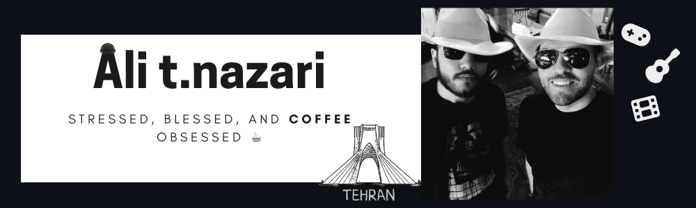

<!-- banner -->
<!-- 

 -->
<!--  -->

<!-- welcome -->

<h1> Hi & Welcome !</h1>

> I'm a dedicated software developer committed for refining my skills and efforting for crafting impactful solutions for the betterment of our community. I actively contribute to open source projects, believing in the power of collaboration and shared knowledge and development. 🍵🍪

<!-- portfolio -->

    

<!--  -->

<!-- about me -->

    <h2>  About me </h2>

- 👀 I’m interested in programming (backend)
- 🤝 I'm open to collaborating on open source projects
- 📫 How to reach me in my bio
- 🌱 I’m currently learning: Nest js 

 Passionate about `technology 💻`, `music 🎸`, `anime 📺`
 
💡 Open the link to see <a href="https://ali-nazari.netlify.app/">My Resume📃</a>

<!--        -->
      

  <h2 align="left">
     Socials
  </h2>
    
 >  Let's connected and collaborating on exciting projects!
<!-- Feel free to reach out for collaboration, contributions, or just a tech chat. -->
    
  

      <!-- linkedin -->
        <a href="https://www.linkedin.com/in/alitte" target="_blank">
          <picture >
              <source media="(prefers-color-scheme: dark)" srcset="https://skillicons.dev/icons?i=linkedin&theme=dark">
              <source media="(prefers-color-scheme: light)" srcset="https://skillicons.dev/icons?i=linkedin&theme=light">
              
          </picture>
        </a>
      <!-- gmail -->
        <a href="mailto:backendwithali@gmail.com" target="_blank">
          <picture>
              <source media="(prefers-color-scheme: dark)" srcset="https://skillicons.dev/icons?i=gmail&theme=dark">
              <source media="(prefers-color-scheme: light)" srcset="https://skillicons.dev/icons?i=gmail&theme=light">
              
          </picture>
        </a>
      <!-- discord -->
        <a href="https://discordapp.com/users/ali.t.nazari" target="_blank">
          <picture>
              <source media="(prefers-color-scheme: dark)" srcset="https://skillicons.dev/icons?i=discord&theme=dark">
              <source media="(prefers-color-scheme: light)" srcset="https://skillicons.dev/icons?i=discord&theme=light">
              
          </picture>
        </a>
  

<!-- skills -->
<h2 align="left">
     Skills
</h2>

    <picture>
        <source media="(prefers-color-scheme: dark)" srcset="https://skillicons.dev/icons?i=js&theme=dark">
        <source media="(prefers-color-scheme: light)" srcset="https://skillicons.dev/icons?i=js&theme=light">
        
    </picture>
    <picture>
        <source media="(prefers-color-scheme: dark)" srcset="https://skillicons.dev/icons?i=ts&theme=dark">
        <source media="(prefers-color-scheme: light)" srcset="https://skillicons.dev/icons?i=ts&theme=light">
        
    </picture>
    <picture>
        <source media="(prefers-color-scheme: dark)" srcset="https://skillicons.dev/icons?i=nodejs&theme=dark">
        <source media="(prefers-color-scheme: light)" srcset="https://skillicons.dev/icons?i=nodejs&theme=light">
        
    </picture>
    <picture>
        <source media="(prefers-color-scheme: dark)" srcset="https://skillicons.dev/icons?i=express&theme=dark">
        <source media="(prefers-color-scheme: light)" srcset="https://skillicons.dev/icons?i=express&theme=light">
        
    </picture>
    <picture>
        <source media="(prefers-color-scheme: dark)" srcset="https://skillicons.dev/icons?i=mongodb&theme=dark">
        <source media="(prefers-color-scheme: light)" srcset="https://skillicons.dev/icons?i=mongodb&theme=light">
        
    </picture>
    <picture>
        <source media="(prefers-color-scheme: dark)" srcset="https://skillicons.dev/icons?i=mysql&theme=dark">
        <source media="(prefers-color-scheme: light)" srcset="https://skillicons.dev/icons?i=mysql&theme=light">
        
    </picture>
    <picture>
        <source media="(prefers-color-scheme: dark)" srcset="https://skillicons.dev/icons?i=redis&theme=dark">
        <source media="(prefers-color-scheme: light)" srcset="https://skillicons.dev/icons?i=redis&theme=light">
        
    </picture>

<!-- stats -->

    

        <h2 align="left">
             My GitHub Stats
        </h2>
    

 
    
    

<!-- top languages-->

<!-- stats -->

<!--profile-trophy -->

<!-- line -->

<!-- spotify -->

<!-- snake animation-->

    

<!-- scroll to top -->

    

